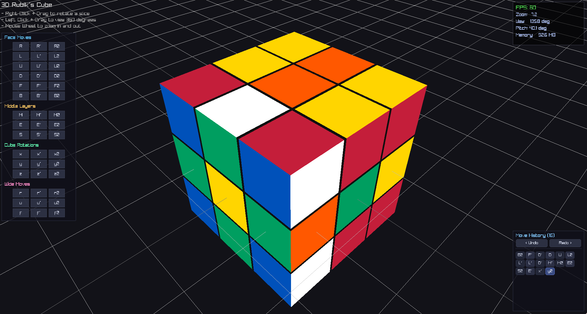

# Rubik's Cube

This is an original Rubik’s Cube project built in C++. It was created for fun and as a way to learn something new while exploring programming concepts.

# Preview 



## Running Locally

Because this project natively hooks into **Nix Flakes**, dependency matching and building is completely automated.

1. Clone the repository and navigate inside:
   ```bash
   git clone https://github.com/sijanthapa171/cube.git
   cd cube
   ```

2. Boot into the guaranteed development shell with the required compiler tools:
   ```bash
   nix develop
   ```

3. Compile the application and systematically spin up the custom graphical window:
   ```bash
   make run
   ```